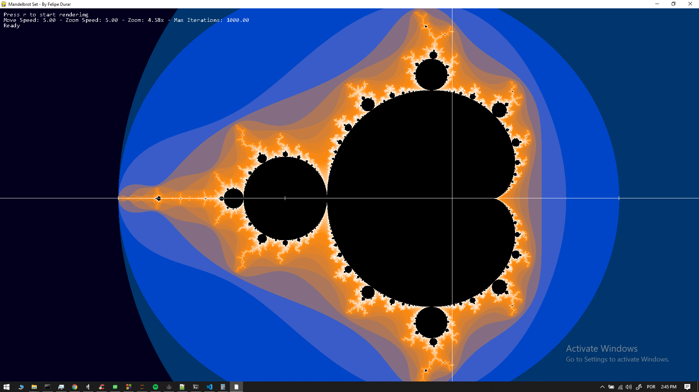
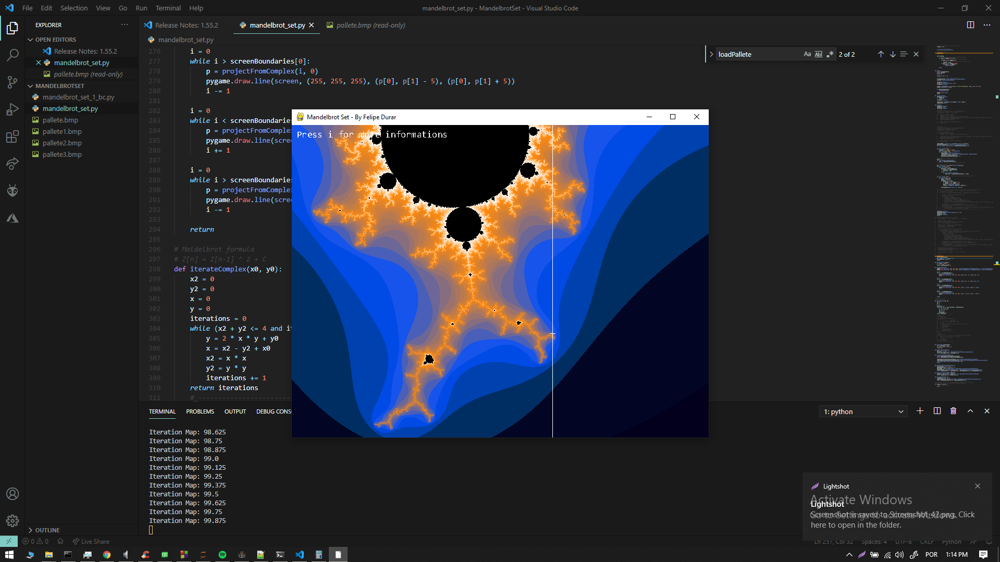

# MandelbrotSet
A Mandelbrot Set Fractal Plotting Application

# What is the Mandelbrot Set
This is a small python application that plots the Mandelbrot Set. The Mandelbrot set is the set of complex numbers c for which the function F[n]=F[n-1]+c does not diverge when iterated from n=0.

# Mandelbrot Set and the nature
There is also some interesting correspondence between the Mandelbrot Set and the logistic map that is an example of chaotic behavior present in many natural forms such as temperature rising, heartbeat, water drop from the tap and others interesting things.

# How it is rendered
The figure above shows the Mandelbrot Set plotted on an complex plane where the axis are represented by the real part and the imaginary part, for iterations that doesn't reaches the iteration limit a scalar value is binded and later a color from a pallet is placed on the complex plane.

# Tip for rendering it
The rendering time may take really long depending on how much iterations it takes for each pixel, so if you're going to run it on your computer i recommend you to set the max iterations to a small value, render some images and adjust the perfect position and later increse the iteration limit to higher values.

# How to Run
You need to have installed on your computer the Python 3.9 and some pip packages
- pygame
- numpy
- PIL

After installing all the pip packages you just need to execute 'python mandelbrot_set.py'. Currently the pallete is set on the code, so if you want to test other palletes or create your own palletes and import on it you just need to set it in the code. The pallete here is a 1-dimensional image to avoid having to make manually the interpolation for the colors.

# Todo
- Color Interpolation
- Multithreading
- Low Res Rendering
- Image Tracking when moving
